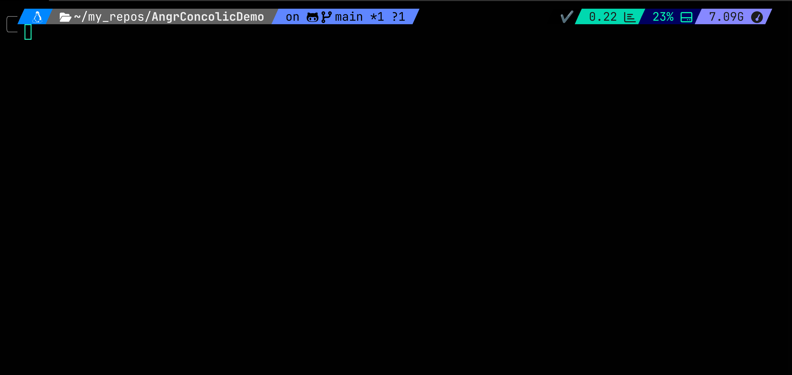

# My setup:
- Shell: zsh
- Shell Environment: Ohmyzsh (zsh theming and plugins)
- Prompt customizers: powerline10k, starship, and ohmyposh (overkill really)
- Edtor: Neovim/vim
- Multiplexer: Tmux
- Spotify-tmux integration (+10 rice-factor points)

Instead of re-configuring everything all over from scrath on a new system, I've created a script to install the necessary packages and copy the relevant config files so I can get my workflow up an running on any (ubuntu) system with a single command.

<br />

# Slim install
Install packages and copy files as needed with one command.  


__Full Installation__: Install all in ubuntu system _(installs packages and copies config files)_
```bash
bash -c "$(wget https://raw.githubusercontent.com/QuantumZenoSix/Dev-Environment/refs/heads/main/scripts/init_full.sh -O -)"
```

<br />

<br />

__Package Installation__: Install programs in ubuntu system _(installs packages only)_
```bash
bash -c "$(wget https://raw.githubusercontent.com/QuantumZenoSix/Dev-Environment/refs/heads/main/scripts/init_installonly.sh -O -)"
```

<br />

<br />

__Config installation__: Install config files in ubuntu system _(config files only - includes nvim)_
```bash
bash -c "$(wget https://raw.githubusercontent.com/QuantumZenoSix/Dev-Environment/refs/heads/main/scripts/init_configonly.sh -O -)"
```
<br />

<br />

__Nvim-only installation__: Install config files in ubuntu system _(nvim files only)_
```bash
bash -c "$(wget https://raw.githubusercontent.com/QuantumZenoSix/Dev-Environment/refs/heads/main/scripts/init_nvimonly.sh -O -)"
```
<br />


<br />


## Full install


__Pop! OS Desktop installation__: Install packages and copies config files in ubuntu system.  
Additionally install preferred desktop applications, create .desktop images for AppImages, install and updates drives and gaming add-ons, perform updates and system cleanup.  
```bash
bash -c "$(wget https://raw.githubusercontent.com/QuantumZenoSix/Dev-Environment/refs/heads/main/scripts/init_os_pop.sh -O -)"
```
<br />


<!--
__Docker VM__:Create a Docker container running Ubuntu Jammy jellyfish (v22)  
```bash
bash -c "$(wget https://raw.githubusercontent.com/QuantumZenoSix/Dev-Environment/refs/heads/main/jammy_init.sh -O -)"
```
-->

# Prompt changer  
Having ohmyzsh as my shell environment, I've added bash functions to allow the changing between three prompt customizers: powerline10k, starship, and ohmyposh.  
Each can be further configured manually or using any of their respective presets.  



<br />

<br />

<br />

## Notes
`install.sh` - Assumes the repo is cloned and installs packages. 
- Run with no arguments to install packages
- Run with "full" to install packages and copy the config files into the proper dirs.
- Run with with "configonly" to skip packages installation step and only copy config files to $HOME.

<br />

`init.sh` - Clones repo and runs `install.sh` (installing both packages and config files)  
